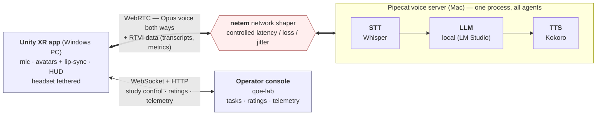

# Architecture at a glance (Unity XR + Pipecat voice server)

A presentation-level view of the study system. Three machines; the conversation itself is a
WebRTC voice loop between the headset and the Mac, and the operator console drives the experiment.

> Renders on GitHub and in most slide tools. To export an image, paste into
> [mermaid.live](https://mermaid.live) → PNG/SVG.

---

## Main diagram



**The voice loop (one turn):** participant speaks → audio goes up over WebRTC (through the netem
shaper) → **STT** transcribes → **LLM** generates the reply → **TTS** speaks it → audio comes back
down → plays through the agent avatar with lip-sync. The participant can talk over the agent at any
time (barge-in).

---

## Component legend

| Component | Where | Role |
|---|---|---|
| **Unity XR app** | Windows study PC | What the participant sees/hears: scenes, avatars, mic capture, voice playback, HUD, ratings |
| **netem shaper** | on the Unity ↔ Mac hop | Injects the controlled network conditions the study measures (voice path only) |
| **STT — Whisper** | Mac (Pipecat) | Speech → text |
| **LLM — local** | Mac (LM Studio) | Text reply, in the selected agent's persona |
| **TTS — Kokoro** | Mac (Pipecat) | Text → the agent's voice |
| **Operator console** | qoe-lab server | Drives the session: which task, when; collects ratings + telemetry |

Two **separate** links leave Unity: the **voice** connection to the Mac (WebRTC, the only path that
is network-shaped) and the **study-control** connection to the operator console (WebSocket + HTTP).
A single agent picker (`agent_id`) tells the Mac which persona + voice to load.

---

## Plain-text version (for slide tools without Mermaid)

```
        voice: WebRTC (Opus both ways + data channel)
   ┌──────────────┐    through netem shaper    ┌─────────────────────────────┐
   │  Unity XR     │ <========================> │  Pipecat server (Mac)        │
   │  (Windows PC) │   latency / loss / jitter  │   STT  ->  LLM  ->  TTS       │
   │  mic·avatars  │                            │  Whisper  local   Kokoro     │
   │  ·HUD·headset │                            └─────────────────────────────┘
   └──────┬───────┘
          │  WebSocket + HTTP  (study control, ratings, telemetry)
          v
   ┌────────────────────┐
   │  Operator console   │
   │  (qoe-lab)          │
   └────────────────────┘
```
