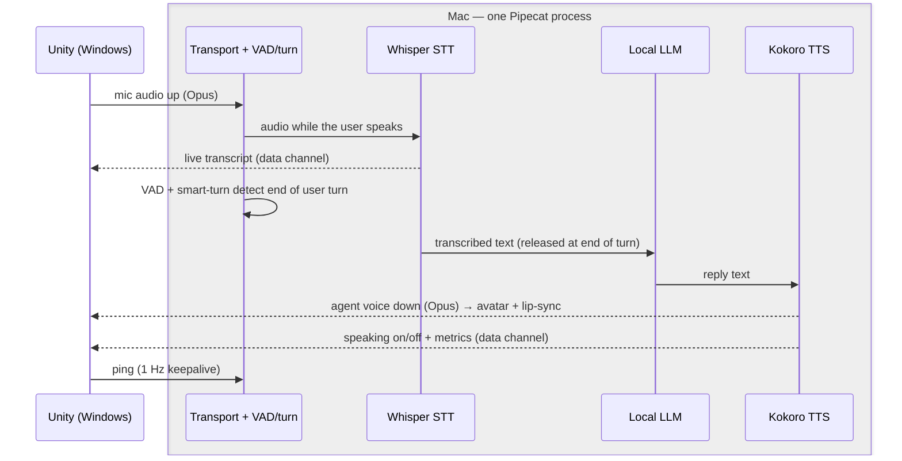
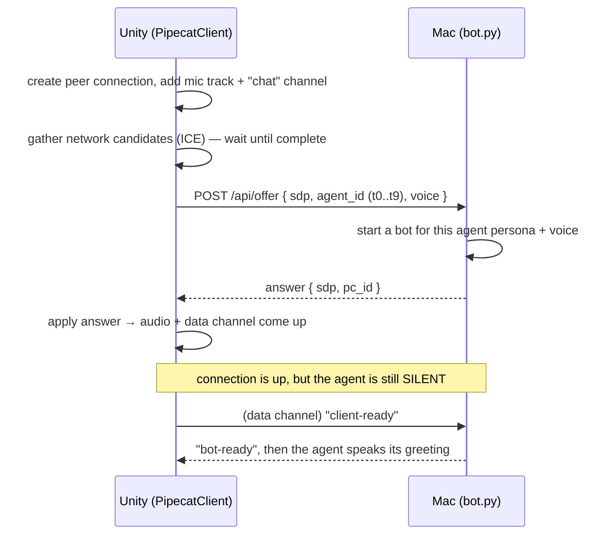
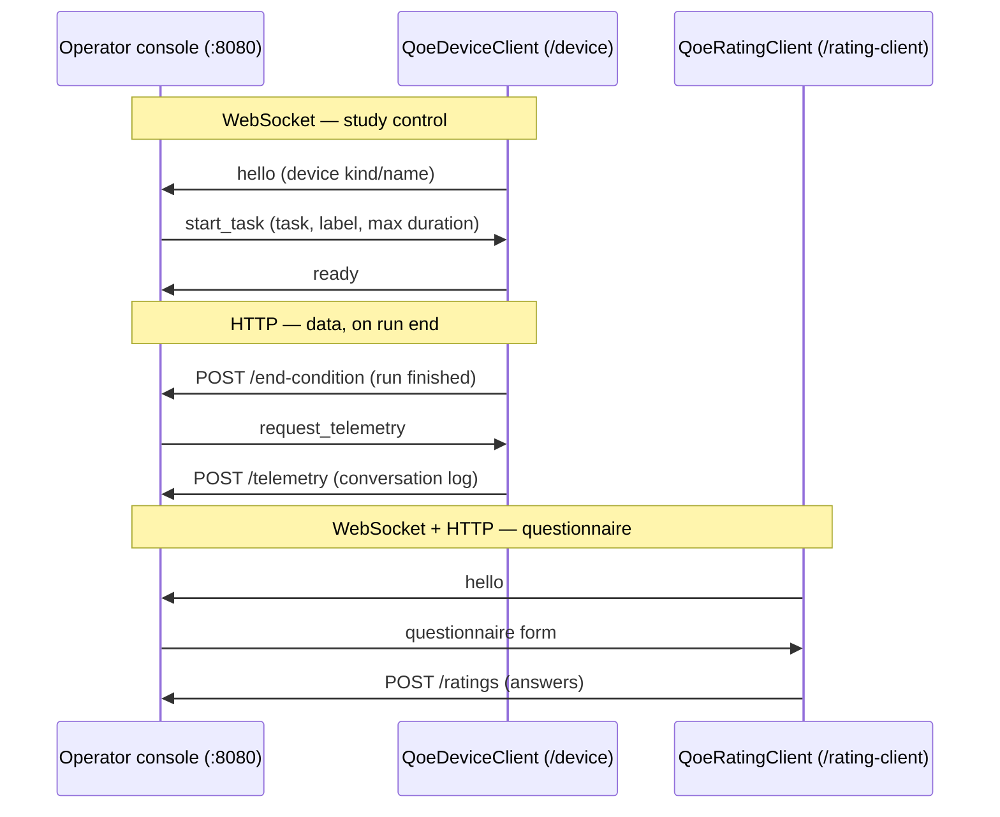
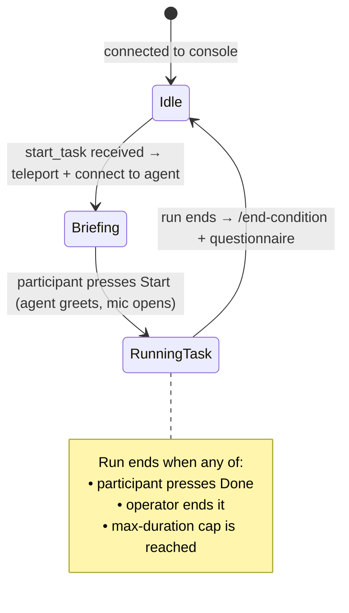

# IVA-CUI — System Overview

A plain-language map of how the QoE study system fits together: the **Unity XR frontend**
(Windows), the **Pipecat voice-agent server** (Mac), and the **qoe-lab operator console** that
runs the study. Read this first; the deeper docs (`REALTIME_WEBRTC_PLAN.md`,
`CONVERSATION_TELEMETRY.md`) drill into individual pieces.

> This describes the **current** system only — the WebRTC voice pipeline. The old HTTP
> ASR→LLM→TTS pipeline has been removed and is not covered here.

---

## 1. The three machines

```
   ┌────────────────────────┐         ┌────────────────────────┐
   │  qoe-lab operator       │         │   Pipecat server (Mac) │
   │  console (laptop/PC)    │         │   bot.py @ :7860       │
   │  :8080                  │         │   Whisper · LLM · TTS  │
   └───────────┬─────────────┘         └───────────┬────────────┘
               │  WebSocket + HTTP                  │  WebRTC
               │  (study control,                   │  (Opus audio +
               │   ratings, telemetry)              │   RTVI data channel)
               │                                    │
               │            ┌───────────────────────┴──┐
               └────────────┤  Unity XR frontend         │
                            │  (Windows study PC)        │
                            │  QoeDeviceClient +         │
                            │  PipecatClient + avatars   │
                            └────────────────────────────┘
```

| Machine | What it runs | Role |
|---|---|---|
| **Windows study PC** | Unity app (the headset is tethered to it) | The thing the participant sees and hears. Draws the XR scenes/avatars, captures the mic, plays the agent's voice, shows the HUD, collects ratings. |
| **Mac** | `bot.py` (Pipecat) on port **7860** | The "brain" of each agent: speech-to-text, a local LLM, text-to-speech. One server serves all 10 agents. |
| **Operator console** | `qoe-lab` server on port **8080** | Runs the experiment: tells the headset which task to start, when, for how long; collects questionnaire ratings and telemetry. The researcher drives this. |

Two **separate** network connections leave the Unity app:

1. **Unity ↔ Mac** — the live voice conversation (WebRTC).
2. **Unity ↔ operator console** — study control and data collection (WebSocket + HTTP).

A **netem** network shaper sits on the **Unity ↔ Mac** hop (the voice path only). That's where
the study introduces the controlled network conditions whose effect on experience we measure.

---

## 2. The voice connection (Unity ↔ Mac, WebRTC)

This is the conversation itself. It's a standard WebRTC peer connection — the same kind a browser
video call uses — carrying **Opus audio both ways** plus a small **data channel** named `"chat"`
for control messages.

One conversational turn. Unity (left) is the only remote end; everything in the box is one
Pipecat process on the Mac. **Arrows crossing the box edge travel over the WebRTC connection**
(solid = Opus audio, dashed = "chat" data-channel events); arrows inside the box are the Mac's
internal pipeline.



**How a connection is set up (the "offer/answer" handshake):**



Key points that make this work in the study:

- **One server, many agents.** Unity sends an `agent_id` (`t0`…`t9`) in the offer. The Mac looks
  that up in `agents_config.py` and loads that agent's persona + default voice. The same Mac
  process serves every agent — no per-agent server.
- **Greeting is held until the participant is ready.** The connection is established *during the
  briefing screen* (so the slow first-response warm-up happens off the clock), but the agent
  doesn't speak until Unity sends `client-ready`, which it only does when the participant presses
  **Start**.
- **The mic is always open during the conversation** (never muted mid-turn). That's what lets the
  participant **interrupt** the agent (barge-in) — interruption is handled entirely on the Mac by
  voice-activity + turn detection. Unity only opens/closes the mic at the *start/end* of the whole
  conversation via a single gate (`StudyControls.conversationGateOpen`).
- **The agent's voice plays through the avatar.** Incoming audio is routed to the agent avatar's
  AudioSource, and a tap on that audio drives the **lip-sync** so the mouth moves.
- **Robust to bad networks.** If the connection drops under heavy loss/latency, Unity automatically
  re-establishes the media path (ICE restart) while keeping the same conversation, instead of
  dying. There's also an optional mic-audio redundancy (Opus FEC) and adjustable mic gain.

**The "chat" data channel (RTVI protocol).** Alongside the audio, the Mac streams small JSON
events: live transcripts, "bot started/stopped speaking", and per-stage timing **metrics**. Unity
uses "started/stopped speaking" to animate the avatar, and **records every event verbatim** for
later analysis (see §4). A 1 Hz `"ping"` keeps the connection alive.

---

## 3. The study connection (Unity ↔ operator console)

This is how the researcher's console drives the session. It's a **WebSocket** for live control plus
a few **HTTP** calls for data. The console is the source of truth for *what* runs *when*; Unity just
obeys.



**Two WebSocket clients** in the Unity app, each to the operator console:

- **`QoeDeviceClient`** (`/device`) — the main study controller on the headset. It:
  - connects and sends a `hello` identifying the device;
  - waits for **`start_task`**, which tells it the task (training vs experiment, task number,
    label, and the **max duration** cap for the run);
  - teleports the participant in front of the right agent, shows the briefing, runs the timed
    conversation, and ends the run;
  - on run end, POSTs **`/end-condition`** to tell the console the run is over;
  - answers **`request_telemetry`** by POSTing the conversation log to **`/telemetry`**.
- **`QoeRatingClient`** (`/rating-client`) — shows the questionnaire (e.g. quality rating, simulator
  sickness) after a run and POSTs the answers to **`/ratings`**.

**The participant's run, end to end:**



The on-screen flow the participant experiences:

1. **Briefing** — a card explains the scenario, what to *find out* from the agent, and any details
   they have to give. The agent connects in the background and greets so it's warm.
2. **Start** — the participant presses Start; the mic opens and the timed conversation begins.
3. **Conversation** — open-mic, full-duplex talk with the agent. The "find out" slots stay on the
   HUD. A **Done** button appears after a fixed delay so the participant can end when finished.
4. **End** — Done (or the operator, or the max-duration cap) ends the run; the questionnaire
   appears; answers are uploaded; back to idle, waiting for the next `start_task`.

---

## 4. What gets recorded (telemetry)

For each run, the headset writes a **conversation log** to disk (and uploads it to the console on
request). The log is the **raw stream of RTVI events** captured straight off the data channel —
transcripts, speaking on/off, and the Mac's own per-stage timing metrics — plus run-level facts
(which task, start/end time, why it ended, the duration cap).

Two design choices matter:

- **No turn-parsing on the device.** Under open-mic + interruption, deciding where one "turn" ends
  is fragile, so Unity stores the server-authoritative event stream **whole** and leaves
  turn/latency analysis to offline processing after the study.
- **Always written locally.** Even debug runs (started without the operator) write a JSON file on
  the device, so nothing is lost if the upload path is idle. The upload to `/telemetry` only
  happens when the console asks (`request_telemetry`).

> `CONVERSATION_TELEMETRY.md` documents the original (HTTP-pipeline) telemetry schema. The current
> system captures the raw RTVI event stream instead; treat that doc's per-leg timing fields as
> historical and the raw-events envelope as authoritative.

---

## 5. The agents (personas + voices)

All agent behavior lives on the Mac in `agents_config.py`:

- **`AGENTS`** — a registry keyed by `agent_id` (`t0`…`t9`, plus training variants `t0b`/`t0c`).
  Each entry is a **persona prompt** + a **default voice** (Kokoro TTS).
- Each prompt = the role persona + a per-agent **FACTS block** (the canonical answers to the task's
  "find out" slots, so every participant gets the same answers) + a shared **style leash**
  (stay in character, short replies, never stall, let the visitor lead, etc.).
- The participant-facing side of these tasks (the briefing cards and "find out" slots shown on the
  HUD) lives in Unity (`QoeDeviceClient.cs`). The two are kept in sync; the design is documented in
  `convo-task-design.md` (in the Degree-Project repo).

The local LLM runs in **LM Studio** on the Mac (`127.0.0.1:1234`), so the whole voice pipeline is
fully local — no cloud, no API keys.

---

## 6. Where things live (quick reference)

| Piece | File |
|---|---|
| WebRTC voice client (mic, audio, RTVI, lip-sync, reconnect) | `iva-cui-unity/Assets/Scripts/PipecatClient.cs` |
| Study controller (WebSocket to console, task lifecycle, HUD) | `iva-cui-unity/Assets/Scripts/QoE/QoeDeviceClient.cs` |
| Questionnaire client | `iva-cui-unity/Assets/Scripts/QoE/QoeRatingClient.cs` |
| Telemetry collector (writes/uploads the conversation log) | `iva-cui-unity/Assets/Scripts/QoE/QoeTurnLog.cs` |
| Pipecat server (signaling, pipeline, agent selection) | `macos-local-voice-agents/server/bot.py` |
| Agent personas + voices + FACTS | `macos-local-voice-agents/server/agents_config.py` |
| Voice-pipeline design notes | `REALTIME_WEBRTC_PLAN.md` |
| Conversation task design (cards + FACTS) | `Degree-Project/individual-plan/convo-task-design.md` |

---

## 7. Glossary

- **WebRTC** — peer-to-peer real-time audio/data transport (browser-call technology). Carries the
  voice both ways and the control data channel.
- **RTVI** — the small JSON message format on the WebRTC data channel (`{id, label:"rtvi-ai", type,
  data}`): transcripts, speaking state, metrics, the `client-ready`/`bot-ready` handshake.
- **Pipecat** — the framework on the Mac that chains the speech-to-text, LLM, and text-to-speech
  stages into one real-time voice pipeline.
- **netem** — the Linux network emulator that shapes the Unity↔Mac link (latency, jitter, loss) to
  create the controlled conditions the study compares.
- **qoe-lab** — the operator console/server that runs the experiment and collects data.
- **Barge-in / full-duplex** — the participant can talk over the agent and it stops; possible
  because the mic stays open during the agent's speech.
- **agent_id (`t0`…`t9`)** — selects which persona + voice the one Mac server uses for a given run.
